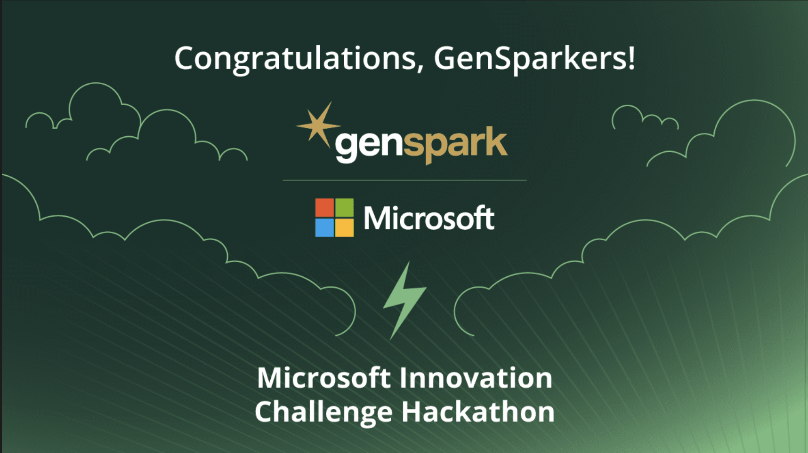

# AzureAI  🧠




AzureAI is an innovative AI-powered agent that transforms how users interact with various content types. Our solution enables seamless conversations with documents, videos, web content, and more through an intuitive chat interface, leveraging Azure AI services to deliver contextually accurate responses grounded in uploaded content.

## 🏆 Project Overview

**Developer:** Aman Jha  
**Program:** AI Engineer Trainee -- GenSpark AI Training Program (2025)  
**Objective:** Developed and deployed enterprise Generative AI pipelines and image/document processing solutions using Azure OpenAI and Azure Functions.  


Our project directly addresses the challenge of enabling users to have meaningful conversations with diverse media content. By combining state-of-the-art Azure AI services with a thoughtfully designed user experience, AzureAI transforms passive content into active knowledge sources that users can query using natural language.


## 🧩 Azure AI Services Integration

Our solution deeply integrates with the Azure AI ecosystem:

- **Azure AI Search**: Powers our RAG (Retrieval Augmented Generation) system
  - Custom vector search implementation with HNSW algorithm
  - Semantic hybrid search combining vector and keyword approaches
  - Optimized chunking strategy with 100-token overlaps for context preservation

- **Azure AI Projects**: Orchestrates our AI components
  - Manages component interactions and dependencies
  - Simplifies deployment and configuration
  - Enables comprehensive monitoring and telemetry

- **Azure AI Inference**: Provides advanced language understanding
  - Handles complex query interpretation
  - Generates contextually aware completions
  - Processes inputs with semantic understanding

- **Azure OpenAI Service**: Delivers powerful language capabilities
  - Embedding generation for vector search (text-embedding-3-large)
  - Intent mapping for query optimization (gpt-4o)
  - Response generation with citation awareness (gpt-4o)

- **Azure Monitor OpenTelemetry**: Ensures system reliability
  - End-to-end tracing of request processing
  - Performance monitoring for optimization
  - Error detection and reporting

### Key Technical Components:

The architectural foundation of ClimAgent is built on these sophisticated components:

- **Chunking Engine**: Intelligently splits documents while preserving context and semantic meaning across sections, ensuring that related information stays connected.

- **Vector Database**: Leverages high-dimensional embeddings (1536 dimensions) to store semantic representations of content, enabling similarity-based retrieval that understands meaning beyond keywords.

- **LLM Orchestration**: Manages the complex prompt engineering required to elicit coherent, accurate responses from large language models, with specialized templates for different tasks.

- **Context Management**: Maintains a dynamic conversation state that evolves as users interact with the system, enabling follow-up questions and clarifications.

- **Media Processing Pipeline**: Transforms diverse content types through specialized extractors, creating a unified text representation that can be processed uniformly regardless of the original format.

## 🚀 Getting Started

### Prerequisites

- Python 3.8+
- Azure account with access to AI services
- Required API keys (detailed in setup instructions)

### Installation

1. Clone the repository:
   ```bash
   git clone <repository-url>
   cd ClimAgent
   ```

2. Install required dependencies:
   ```bash
   pip install -r requirements.txt
   ```

3. Create a `.env` file with your API keys:
   ```
   AIPROJECT_CONNECTION_STRING=<Your Azure AI Project connection string>
   AISEARCH_INDEX_NAME=<Your Azure AI Search index name>
   INTENT_MAPPING_MODEL=<Model for intent mapping, e.g. gpt-4o>
   EMBEDDINGS_MODEL=<Model for embeddings, e.g. text-embedding-3-large>
   CHAT_MODEL=<Model for chat completions, e.g. gpt-4o>
   GROQ_API_KEY=<Your Groq API key>
   OPENAI_API_KEY=<Your OpenAI API key>
   ```

4. Launch the application:
   ```bash
   streamlit run app.py
   ```

## 📋 Code Quality & Implementation Highlights

Our implementation goes far beyond sample code, with sophisticated features:

- **Advanced Prompt Engineering**: Carefully crafted prompts in the `assets/` folder
  - Intent mapping optimization for better search queries
  - Grounded generation to prevent hallucinations
  
- **Chunking Strategy**: Intelligent document segmentation
  - Semantic chunking that respects document structure
  - Overlap management for context preservation
  - Metadata enrichment for improved retrieval

- **Error Handling**: Robust implementation for reliability
  - Graceful degradation when services are unavailable
  - Comprehensive logging for debugging
  - User-friendly error messages

- **Security Considerations**:
  - Proper handling of sensitive API keys via .env
  - Input validation to prevent injection attacks
  - No permanent storage of user content unless explicitly requested


## 🧪 Technical Challenges Overcome

Our team tackled significant technical hurdles:

- **Vector Search Optimization**: Fine-tuned search parameters to balance speed and accuracy
- **Contextual Awareness**: Implemented sophisticated prompt engineering to maintain conversation context
- **Media Processing Pipeline**: Created a unified system for handling diverse content types
- **Grounding Mechanism**: Developed techniques to ensure responses are based only on actual content
- **Real-time UI**: Engineered a responsive interface that handles large document processing smoothly

Made with 💚 by Aman Jha!

*This project was developed for the Microsoft AI Agents Hackathon 2025. All rights reserved.*
